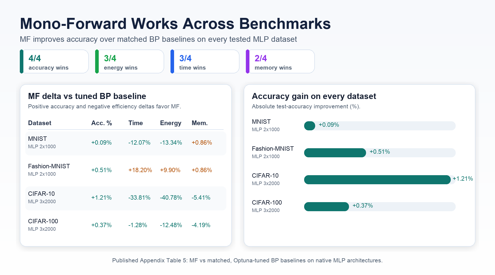

<p align="center">
  <h1 align="center">Energy-Efficient Deep Learning<br>Without Backpropagation</h1>
  <p align="center"><b>A Rigorous Evaluation of Forward-Only Algorithms</b></p>
  <p align="center">
    Hardware-validated FF, CaFo, and Mono-Forward experiments, testing when<br>
    forward-only training beats tuned backpropagation on identical architectures.
  </p>
</p>

<p align="center">
  <a href="https://arxiv.org/abs/2511.01061"></a>
  <a href="./LICENSE"></a>
  <a href="#installation--requirements"></a>
  <a href="https://github.com/Przemyslaw11/BeyondBackpropagation/stargazers"></a>
  <a href="https://github.com/Przemyslaw11/BeyondBackpropagation/commits/main"></a>
</p>

<p align="center">
  <a href="https://arxiv.org/abs/2511.01061">Paper</a> ·
  <a href="#highlights--key-results">Key Results</a> ·
  <a href="#quickstart--usage">Quickstart</a> ·
  <a href="#installation--requirements">Installation</a> ·
  <a href="#citation">Citation</a>
</p>

---

**Table of Contents**

- [Abstract / TL;DR](#abstract--tldr)
- [Highlights / Key Results](#highlights--key-results)
- [Repository Structure](#repository-structure)
- [Installation & Requirements](#installation--requirements)
- [Data Preparation](#data-preparation)
- [Quickstart / Usage](#quickstart--usage)
- [Configuration](#configuration)
- [Pretrained Models / Checkpoints](#pretrained-models--checkpoints)
- [Scope and Limitations](#scope-and-limitations)
- [Citation](#citation)
- [License & Acknowledgements](#license--acknowledgements)

---

> **Paper:** [arXiv:2511.01061](https://arxiv.org/abs/2511.01061) &nbsp;|&nbsp;
> **Authors:** Przemyslaw Spyra, Witold Dzwinel &nbsp;|&nbsp;
> **Institution:** AGH University of Krakow, Faculty of Computer Science

<p align="center">
  
</p>
<p align="center">
  <em>
    Mono-Forward improves accuracy on every tested MLP benchmark,
    with the largest efficiency gains on CIFAR-10 and consistent energy
    gains on three of four datasets.
  </em>
</p>

## Abstract / TL;DR

### How the algorithms differ

| Algorithm | Backward pass? | Local or global loss? | Key constraint | Best on |
|---|---|---|---|---|
| BP | Yes | Global end-to-end | Backward locking | Strong baseline |
| FF | No | Local goodness | Slow convergence | Simple MLPs |
| CaFo | No | Local predictors | Feature-quality trade-off | CNN studies |
| MF | No | Local projection losses | MLP-only validated | MLP benchmarks |

Full experimental protocol is in the paper.

Backpropagation is powerful, but it is not the only viable training signal for deep networks. This repository implements and evaluates three backpropagation-free algorithms - Forward-Forward (FF), Cascaded Forward (CaFo), and Mono-Forward (MF) - against backpropagation baselines that use the same native architectures and systematic Optuna tuning. The main result is that MF consistently exceeds the tuned BP baseline on MLP classification accuracy while reducing energy and time on the harder CIFAR MLP tasks. The experiments also show that "no backward pass" does not automatically mean lower memory use; direct hardware measurement is necessary.

In this paper, we...

- define a fair comparison protocol: identical native architectures, universal hyperparameter search, early stopping, and direct hardware-level metrics;
- validate Mono-Forward as a practical BP-free MLP training algorithm with higher accuracy than tuned BP baselines;
- quantify real energy, time, peak memory, GFLOPs, and CO2e rather than relying only on theoretical savings;
- show that FF is competitive in accuracy but inefficient in wall-clock time and energy;
- show that CaFo exposes a sharp feature-quality trade-off: random features save some resources but lose accuracy, while DFA features improve accuracy at high cost.

## Highlights / Key Results

Published comparisons are against equally tuned BP baselines on identical native architectures. They are not external dataset-leaderboard SOTA claims against modern CNNs or Transformers.

### Representative measured results

All values are reported on the held-out test split and averaged over 3 runs in the paper. Higher accuracy is better; lower time, energy, and memory are better.

| Dataset | Architecture | Algorithm | Test accuracy (%) | Train time (s) | Energy (Wh) | Peak memory (MiB) |
|---|---:|---|---:|---:|---:|---:|
| Fashion-MNIST | MLP 4x2000 | FF-AdamW | **89.63** | 574.60 | 14.28 | 1190 |
| Fashion-MNIST | MLP 4x2000 | BP baseline | 88.88 | **43.09** | **1.48** | **1168** |
| CIFAR-10 | MLP 3x2000 | MF | **62.34** | **177.70** | **3.17** | **1120** |
| CIFAR-10 | MLP 3x2000 | BP baseline | 61.13 | 268.45 | 5.35 | 1184 |

### Full published delta summary vs BP

`Delta Acc. (%)` is the absolute test-accuracy difference. Other deltas are relative percent changes. Bold values favor the forward-only method.

| Family | Dataset | Architecture / variant | Delta Acc. (%) | Delta time | Delta energy | Delta memory |
|---|---|---|---:|---:|---:|---:|
| FF | Fashion-MNIST | MLP 4x2000 | **+0.75** | +1233.26% | +862.35% | +1.88% |
| FF | MNIST | MLP 3x1000 | **+0.24** | +342.11% | +339.95% | +0.85% |
| FF | MNIST | MLP 4x2000 | -0.01 | +305.08% | +236.88% | +1.88% |
| CaFo-Rand-CE | MNIST | 3-block CNN | -0.32 | +88.48% | +32.65% | **-6.67%** |
| CaFo-DFA-CE | MNIST | 3-block CNN | **+0.08** | +124.82% | +81.83% | +1.11% |
| CaFo-Rand-CE | Fashion-MNIST | 3-block CNN | **+1.11** | +205.00% | +115.99% | **-6.67%** |
| CaFo-DFA-CE | Fashion-MNIST | 3-block CNN | **+2.47** | +206.51% | +201.43% | +1.11% |
| CaFo-Rand-CE | CIFAR-10 | 3-block CNN | -13.23 | **-2.96%** | **-19.24%** | **-8.98%** |
| CaFo-DFA-CE | CIFAR-10 | 3-block CNN | -1.72 | +287.17% | +301.94% | +1.26% |
| CaFo-Rand-CE | CIFAR-100 | 3-block CNN | -11.44 | +246.27% | +188.87% | **-5.02%** |
| CaFo-DFA-CE | CIFAR-100 | 3-block CNN | -4.43 | +557.19% | +576.82% | +2.51% |
| MF | MNIST | MLP 2x1000 | **+0.09** | **-12.07%** | **-13.34%** | +0.86% |
| MF | Fashion-MNIST | MLP 2x1000 | **+0.51** | +18.20% | +9.90% | +0.86% |
| MF | CIFAR-10 | MLP 3x2000 | **+1.21** | **-33.81%** | **-40.78%** | **-5.41%** |
| MF | CIFAR-100 | MLP 3x2000 | **+0.37** | **-1.28%** | **-12.48%** | **-4.19%** |

## Repository Structure

```text
.
|-- .gitignore                         # ignores generated data, checkpoints, results, wandb, caches
|-- LICENSE                            # MIT license
|-- README.md                          # this file
|-- requirements.txt                   # Python runtime dependencies
|-- configs/
|   |-- base.yaml                      # shared defaults: device, data root, logging, monitoring, tuning
|   |-- bp_baselines/                  # tuned BP baselines matching FF/MF/CaFo architectures
|   |-- ff/                            # final Forward-Forward experiment configs
|   |-- cafo/                          # final Cascaded Forward and CaFo-DFA configs
|   |-- mf/                            # final Mono-Forward experiment configs
|   `-- tuning/                        # Optuna search configs for BP, FF, CaFo, and MF
|-- scripts/
|   |-- run_experiment.py              # single train-and-test entry point
|   |-- run_optuna_search.py           # Optuna HPO entry point
|   |-- slurm_scripts/
|   |   |-- run_single_experiment.slurm
|   |   |-- run_array.slurm
|   |   `-- run_optuna.slurm
|   `-- tuning_utils/                  # utilities that update YAML configs from Optuna studies
|-- slurm_logs/
|   |-- bp/                            # recorded BP experiment stdout/stderr
|   |-- ff/                            # recorded FF experiment stdout/stderr
|   |-- cafo/                          # recorded CaFo experiment stdout/stderr
|   `-- mf/                            # recorded MF experiment stdout/stderr
`-- src/
    |-- algorithms/                    # FF, CaFo, and MF training/evaluation loops
    |-- architectures/                 # FF_MLP, MF_MLP, and CaFo_CNN modules
    |-- baselines/                     # standard BP training baseline
    |-- data_utils/                    # torchvision datasets, splits, transforms
    |-- training/                      # experiment orchestration engine
    |-- tuning/                        # Optuna objective functions
    `-- utils/                         # config parsing, logging, monitoring, profiling, metrics
```

Generated directories are intentionally absent from a clean checkout:

- `data/`: created by torchvision when `data.download: true`;
- `results/`: created by experiments and Optuna runs;
- `checkpoints/`: created when a config enables checkpointing;
- `wandb/`: created for local/offline Weights & Biases logs.

## Installation & Requirements

Tested paper environment:

| Component | Version |
|---|---|
| OS | Rocky Linux 9.5 |
| CPU | AMD EPYC 7742 @ 2.25 GHz |
| GPU | NVIDIA A100-SXM4-40GB |
| NVIDIA driver | 570.86.15 |
| CUDA toolkit | 12.4.0 |
| Python | 3.10.4 |
| PyTorch | 2.4.0 + cu121 |
| Torchvision | 0.19.0 |
| Optuna | 4.2.1 |
| CodeCarbon | 3.0.1 |
| Weights & Biases | 0.19.8 |
| pynvml | 12.0.0 |

### Option A: virtualenv

```bash
git clone https://github.com/Przemyslaw11/BeyondBackpropagation.git
cd BeyondBackpropagation
python3.10 -m venv venv
source venv/bin/activate
python -m pip install --upgrade pip
pip install -r requirements.txt
python -c "import torch; print(torch.__version__, torch.cuda.is_available())"
```

### Option B: conda

```bash
git clone https://github.com/Przemyslaw11/BeyondBackpropagation.git
cd BeyondBackpropagation
conda create -n beyond-bp python=3.10 -y
conda activate beyond-bp
python -m pip install --upgrade pip
pip install -r requirements.txt
python -c "import torch; print(torch.__version__, torch.cuda.is_available())"
```

### Athena / SLURM environment

```bash
module purge
module load Python/3.10.4
module load CUDA/12.4.0
python3 -m venv venv
source venv/bin/activate
pip install -r requirements.txt
```

Before submitting jobs, edit the account line in `scripts/slurm_scripts/*.slurm`:

```bash
#SBATCH -A <your_grant_name>-gpu-a100
```

Common install pitfalls:

- If `torch.cuda.is_available()` is `False` on a login node, test inside a GPU allocation or SLURM job.
- If PyTorch installs a CPU wheel, reinstall the CUDA-compatible wheel for your cluster.
- If `pynvml` reports missing drivers, run on an NVIDIA GPU node with NVML available.
- If package installation is slow on Athena, download wheels elsewhere and install from the wheel directory.

```bash
pip install --no-index --find-links=./wheels -r requirements.txt
```

- If W&B cannot reach the network on compute nodes, run offline and sync later.

```bash
export WANDB_MODE=offline
```

## Data Preparation

The code uses torchvision datasets and downloads them automatically when `data.download: true` or `data.root: ./data` is present in the config.

| Dataset | Source | Config names |
|---|---|---|
| MNIST | https://yann.lecun.com/exdb/mnist/ | `MNIST` |
| Fashion-MNIST | https://github.com/zalandoresearch/fashion-mnist | `FashionMNIST` |
| CIFAR-10 | https://www.cs.toronto.edu/~kriz/cifar.html | `CIFAR10` |
| CIFAR-100 | https://www.cs.toronto.edu/~kriz/cifar.html | `CIFAR100` |

Expected layout after first download:

```text
data/
|-- MNIST/
|   `-- raw/
|-- FashionMNIST/
|   `-- raw/
|-- cifar-10-batches-py/
`-- cifar-100-python/
```

Splits and preprocessing:

- MNIST uses a fixed 50k train / 10k validation split, plus the official 10k test split.
- Fashion-MNIST, CIFAR-10, and CIFAR-100 use `val_split: 0.1` from the training set unless changed in YAML.
- CIFAR training uses random crop and horizontal flip; validation/test uses normalization only.
- No separate preprocessing command is required.

To use pre-downloaded data, set `data.root` in the config:

```yaml
data:
  root: /path/to/datasets
  download: false
```

## Quickstart / Usage

The simplest reproducible path is to run a single MF experiment. The command trains, evaluates on the test split, and logs final metrics.

```bash
python scripts/run_experiment.py --config configs/mf/mnist_mlp_2x1000.yaml
```

Main CIFAR-10 MF result from the paper:

```bash
python scripts/run_experiment.py --config configs/mf/cifar10_mlp_3x2000.yaml
```

BP baseline for the same CIFAR-10 MLP architecture:

```bash
python scripts/run_experiment.py --config configs/bp_baselines/cifar10_mlp_3x2000_bp.yaml
```

Representative FF and CaFo runs:

```bash
python scripts/run_experiment.py --config configs/ff/fashion_mnist_mlp_4x2000.yaml
python scripts/run_experiment.py --config configs/cafo/cafodfa_cifar10_cnn_3block.yaml
```

Run hyperparameter search:

```bash
python scripts/run_optuna_search.py --config configs/tuning/mf_cifar10_mlp_3x2000_mf_tune.yaml --n-trials 50
```

Run on SLURM:

```bash
sbatch --job-name="MF_CIFAR10" scripts/slurm_scripts/run_single_experiment.slurm configs/mf/cifar10_mlp_3x2000.yaml
```

Expected final log fields:

```text
Test Set Results: Acc: 62.34%
final/training_duration_sec: 177.70
final/total_gpu_energy_wh: 3.17
final/peak_gpu_mem_used_mib: 1120
```

Values are from the paper (3-run mean); your run may vary slightly.

## Configuration

Configs are plain YAML and are merged with `configs/base.yaml` by `src/utils/config_parser.py`.

Key fields:

| Field | Meaning |
|---|---|
| `experiment_name` | Run name used for logs, W&B, results, and checkpoints. |
| `algorithm.name` | One of `BP`, `FF`, `CaFo`, or `MF`. |
| `data.name` | One of `MNIST`, `FashionMNIST`, `CIFAR10`, `CIFAR100`. |
| `data.root` | Dataset directory. Defaults to `./data`. |
| `data.val_split` | Validation fraction for non-MNIST datasets. |
| `data_loader.batch_size` | Training batch size. |
| `model.name` | `FF_MLP`, `MF_MLP`, or `CaFo_CNN`. |
| `model.params.hidden_dims` | MLP hidden widths for FF and MF. |
| `model.params.block_channels` | CNN block channels for CaFo. |
| `optimizer.lr`, `optimizer.weight_decay` | BP optimizer settings. |
| `algorithm_params.lr` | MF layer-local optimizer learning rate. |
| `algorithm_params.epochs_per_layer` | Number of local MF epochs per layer. |
| `algorithm_params.ff_learning_rate` | FF local goodness optimizer learning rate. |
| `algorithm_params.downstream_learning_rate` | FF downstream classifier learning rate. |
| `algorithm_params.predictor_lr` | CaFo local predictor learning rate. |
| `algorithm_params.num_epochs_per_block` | CaFo block/predictor training budget. |
| `monitoring.energy_enabled` | Enables NVML energy sampling. |
| `profiling.enabled` | Enables forward-pass GFLOP profiling. |
| `carbon_tracker.enabled` | Enables CodeCarbon emissions estimation. |

Point to a custom dataset:

```yaml
data:
  name: CIFAR10
  root: /absolute/path/to/data
  download: false
```

Add a new dataset by extending:

- `src/data_utils/datasets.py`
- `src/data_utils/preprocessing.py`

Add a new model by extending:

- `src/architectures/`
- `src/training/engine.py`

## Pretrained Models / Checkpoints

Pretrained checkpoints are not shipped in the repository. Configs write checkpoints under `checkpoints/<experiment_name>/`, and `checkpoints/` is gitignored.

| Model | Status | Parameters | Training data | Published score |
|---|---|---:|---|---|
| MF MLP 2x1000 | coming soon | 1.82M instantiated trainable params | MNIST | +0.09% accuracy vs BP |
| MF MLP 2x1000 | coming soon | 1.82M instantiated trainable params | Fashion-MNIST | +0.51% accuracy vs BP |
| MF MLP 3x2000 | coming soon | 14.26M instantiated trainable params | CIFAR-10 | 62.34% test accuracy, 40.78% less energy than BP |
| MF MLP 3x2000 | coming soon | 15.26M instantiated trainable params | CIFAR-100 | +0.37% accuracy, 12.48% less energy than BP |

<details>
<summary>Generate checkpoints yourself</summary>

Enable checkpointing by setting `checkpointing.checkpoint_dir` in the config:

```yaml
checkpointing:
  checkpoint_dir: "checkpoints/mf_cifar10_mlp_3x2000"
```

The CIFAR-10 MF config already enables this path. Run:

```bash
python scripts/run_experiment.py --config configs/mf/cifar10_mlp_3x2000.yaml
```

Checkpoint files will appear under:

```text
checkpoints/mf_cifar10_mlp_3x2000/
|-- mf_matrix_M0_complete.pth
|-- mf_layer_1_complete.pth
|-- mf_layer_2_complete.pth
`-- mf_layer_3_complete.pth
```

The "coming soon" rows above will be replaced with direct download links when checkpoints are uploaded.

</details>

Expected future checkpoint layout:

```text
checkpoints/
|-- mf_mnist_mlp_2x1000/
|-- mf_fashion_mnist_mlp_2x1000/
|-- mf_cifar10_mlp_3x2000/
`-- mf_cifar100_mlp_3x2000/
```

## Scope and Limitations

- MF is validated here on MLP architectures; CNN and Transformer adaptations remain open work.
- FF and CaFo are included as evolutionary baselines, not as the recommended high-efficiency path.
- Memory savings are empirical, not guaranteed by removing the backward pass.
- Energy numbers depend on hardware, driver, CUDA, PyTorch, and NVML behavior.
- The repository currently has train-and-test scripts, but no standalone checkpoint inference CLI.

## Citation

```bibtex
@misc{spyra2025energyefficientdeeplearningbackpropagation,
      title={Energy-Efficient Deep Learning Without Backpropagation: A Rigorous Evaluation of Forward-Only Algorithms}, 
      author={Przemysław Spyra and Witold Dzwinel},
      year={2025},
      eprint={2511.01061},
      archivePrefix={arXiv},
      primaryClass={cs.LG},
      url={https://arxiv.org/abs/2511.01061}, 
}
```

## License & Acknowledgements

This repository is released under the [MIT License](LICENSE).

Acknowledgements:

- Geoffrey Hinton for the Forward-Forward algorithm.
- Zhao et al. for the Cascaded Forward algorithm and CaFo formulation.
- Gong, Li, and Abdulla for the Mono-Forward algorithm.
- torchvision dataset maintainers for MNIST, Fashion-MNIST, CIFAR-10, and CIFAR-100 loaders.
- ACK Cyfronet AGH / Athena for A100 compute used in the reported experiments.
